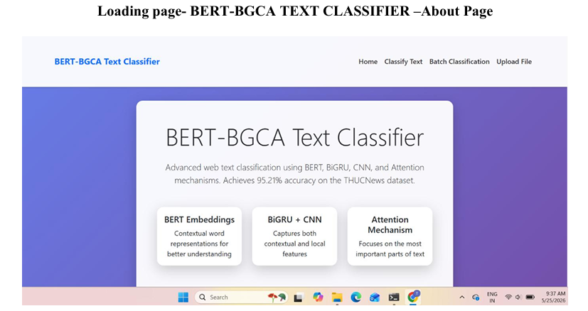
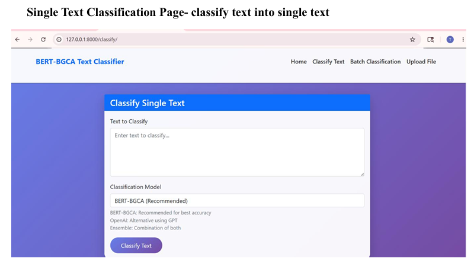
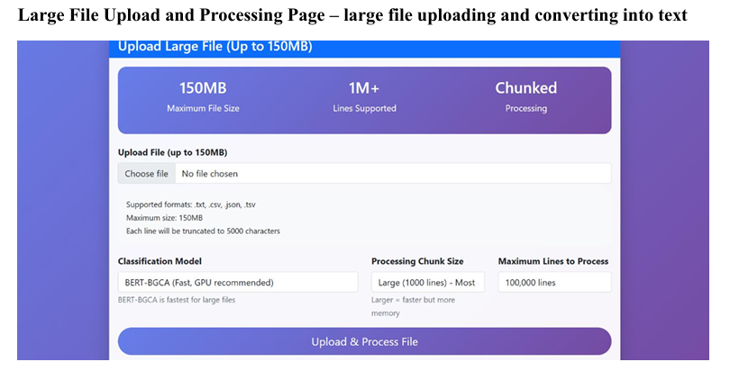
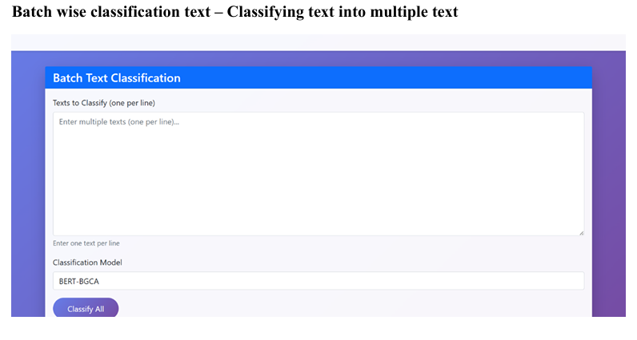
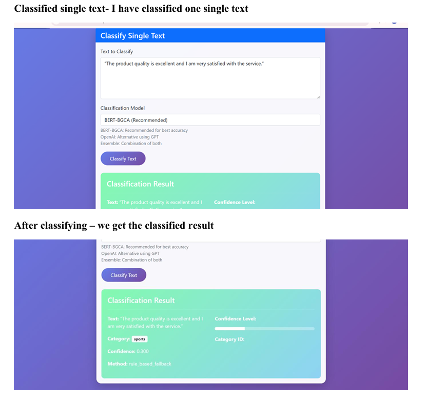

# 🌐 Natural Language Processing: Web Text Classification

<p align="center">
  <b>Classifying web text using NLP and Deep Learning</b>
</p>

<p align="center">
  
  
  
  
</p>

---

## 📌 Project Overview

This project focuses on **Natural Language Processing (NLP)** and deep learning techniques to classify text collected from web sources. It provides a web interface where users can enter text, upload files, or process multiple text inputs and view classification results.

The project explores different classification approaches, including **BERT-BGCA**, **OpenAI-based classification**, and an **ensemble approach**.

## 🎯 Objectives

* Process and analyze text using NLP techniques.
* Classify web text through deep learning-based approaches.
* Provide a user-friendly web interface for text classification.
* Display classification results for individual and multiple text inputs.
* Explore and compare different classification approaches.

## ✨ Features

* 📝 **Single Text Classification** – Enter text and view its classification result.
* 📂 **File Upload** – Upload a file for text classification.
* 📚 **Batch Classification** – Process multiple text inputs.
* 📊 **Results Display** – View the output through the web interface.
* 🧠 **Multiple Approaches** – Explore BERT-BGCA, OpenAI-based, and ensemble classification.

## 🛠️ Technologies Used

| Technology        | Purpose                                         |
| ----------------- | ----------------------------------------------- |
| Python            | Main programming language                       |
| NLP               | Text processing and analysis                    |
| Deep Learning     | Text classification                             |
| BERT-BGCA         | Classification approach explored in the project |
| OpenAI            | AI-based classification approach                |
| Ensemble Learning | Combining classification approaches             |
| Web Technologies  | User interface and result presentation          |

## 🏗️ Project Architecture

```text
                 ┌─────────────────────────┐
                 │       User Input        │
                 │                         │
                 │  • Single Text          │
                 │  • File Upload          │
                 │  • Batch Text           │
                 └────────────┬────────────┘
                              │
                              ▼
                 ┌─────────────────────────┐
                 │     Text Processing     │
                 │   NLP / Preprocessing   │
                 └────────────┬────────────┘
                              │
                              ▼
                 ┌─────────────────────────┐
                 │ Classification Methods  │
                 │                         │
                 │  • BERT-BGCA             │
                 │  • OpenAI-based         │
                 │  • Ensemble             │
                 └────────────┬────────────┘
                              │
                              ▼
                 ┌─────────────────────────┐
                 │   Classification Output │
                 │                         │
                 │  Results shown to user  │
                 │  through the web app    │
                 └─────────────────────────┘
```

## 🖥️ Application Screenshots

> These images are stored inside the `NLP-Web-Text-Classification/screenshots/` directory. The paths below are written relative to this **root README.md**.

### 🏠 Home Page



### 📝 Single Text Classification



### 📂 File Upload



### 📚 Batch Text Classification



### 📊 Classification Results



## 📈 Reported Performance

The project report records the following performance metrics:

| Metric   | Reported value |
| -------- | -------------: |
| Accuracy |         95.21% |
| F1-score |         94.36% |

*These are values reported in the project report; they should not be interpreted as independently reproduced results.*

## 📁 Repository Structure

```text
NLP-Web-Text-Classification/
│
├── README.md
│
└── NLP-Web-Text-Classification/
    ├── README.md
    ├── screenshots/
    │   ├── home.png
    │   ├── single_text.png
    │   ├── file_upload.png
    │   ├── batch_text.png
    │   └── results.png
    │
    ├── docs/
    ├── src/
    ├── requirements.txt
    └── DATASET.md
```

## 🚀 Getting Started

### 1. Clone the repository

```bash
git clone https://github.com/ChAnjali304/NLP-Web-Text-Classification.git
```

### 2. Open the project folder

```bash
cd NLP-Web-Text-Classification/NLP-Web-Text-Classification
```

### 3. Install dependencies

```bash
pip install -r requirements.txt
```

### 4. Run the application

Check the project's source code and documentation for the correct application entry-point file and run command.

## 📚 Documentation

Additional project information is available in the inner project directory:

* [Project README](./NLP-Web-Text-Classification/README.md)
* [Dataset Information](./NLP-Web-Text-Classification/DATASET.md)
* [Project Documentation Folder](./NLP-Web-Text-Classification/docs/)

## 👩‍💻 Author

**Anjali**

GitHub: [ChAnjali304](https://github.com/ChAnjali304)

## ⭐ Acknowledgement

This project was developed as an exploration of NLP, deep learning, and web-based text classification.

---

<p align="center">
  <b>Thank you for visiting this project! ⭐</b>
</p>
